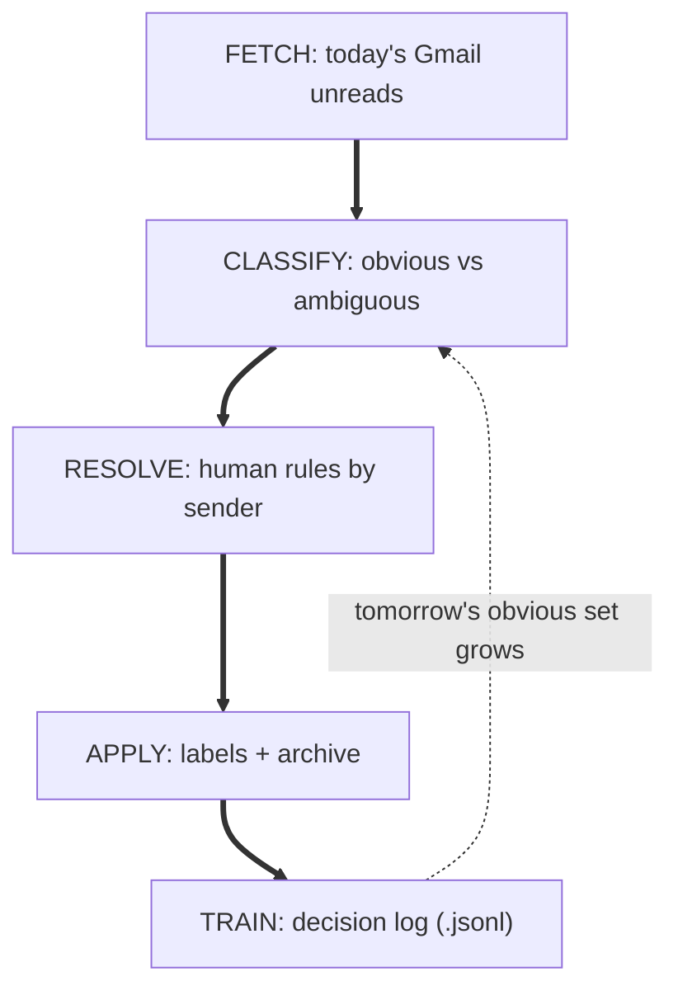

# Email Sweep

**A Claude Code plugin for a daily, compounding Gmail inbox sweep.**

`/email-sweep` runs an end-of-day pass over your Gmail inbox: it auto-labels the obvious threads, batches the ambiguous ones by sender for quick human rulings, and logs every decision to a training log that seeds tomorrow's auto-rules. The system is designed to compound — today's "ambiguous" set shrinks every week as yesterday's rulings become standing rules.



---

## Command

One slash command drives the whole loop. It activates the `email-sweep` skill automatically.

| Command | What It Does | When To Run |
|---------|--------------|-------------|
| `/email-sweep:sweep --init` | First-run setup — verifies CLI on PATH, Python deps, Claude Code permissions, OAuth credentials + token, syncs the label taxonomy to Gmail, cross-checks CLI ↔ MCP auth. Idempotent — safe to re-run. | Once after install, and any time setup drifts (new machine, revoked token, edited taxonomy) |
| `/email-sweep:sweep` | Classify today's unread threads, confirm obvious batch, walk ambiguous by sender, apply labels, log decisions | Daily, end-of-day — ~60 seconds |
| `/email-sweep:sweep --all` | Full inbox sweep (read + unread, any age) instead of today's unreads only | Weekly catch-up, or after skipped days |

---

## Quick Start

> **Before you start:** this plugin uses the Claude.ai **Gmail connector** (the `mcp__claude_ai_Gmail__*` tools). You need to be signed in to Claude Code with a claude.ai account (Pro/Max/Team) and have the Gmail connector enabled — see [Requirements](#requirements). Raw ANTHROPIC_API_KEY auth won't have these tools.

<details>
<summary><b>Claude Code — Marketplace install (recommended)</b></summary>

```
/plugin marketplace add jasonjgarcia24/email-sweep
/plugin install email-sweep@jason-email-sweep
```

That wires up the `email-sweep` skill and the `/email-sweep:sweep` slash command. Then run:

```
/email-sweep:sweep --init
```

to complete the first-run setup (CLI symlink, OAuth credentials + token, label taxonomy sync, permissions check, CLI ↔ MCP account match). `--init` is idempotent — it detects what's already in place and only fixes what's missing. See the **OAuth setup** section below for the one-time Google Cloud Console steps `--init` will walk you through.

> **Why `/email-sweep:sweep` and not `/email-sweep`?** Claude Code namespaces plugin commands as `<plugin-name>:<command-name>` to avoid collisions. Plugin name here is `email-sweep`; command is `sweep`. Manual install (below) drops the namespace and lets you invoke it as `/email-sweep`.

> **SSH errors?** The marketplace clones repos via SSH. If you don't have SSH keys set up on GitHub, either [add your SSH key](https://docs.github.com/en/authentication/connecting-to-github-with-ssh/adding-a-new-ssh-key-to-your-github-account) or switch to HTTPS for fetches only:
> ```bash
> git config --global url."https://github.com/".insteadOf "git@github.com:"
> ```

</details>

<details>
<summary><b>Claude Code — Local / development clone</b></summary>

Useful if you want to edit the skill or the command in place and see changes without reinstalling.

```bash
git clone https://github.com/jasonjgarcia24/email-sweep.git ~/code/email-sweep
claude --plugin-dir ~/code/email-sweep
```

</details>

<details>
<summary><b>Manual install (no plugin marketplace)</b></summary>

If you're not using the plugin marketplace (or want to bolt this onto an existing Claude Code config manually):

```bash
git clone https://github.com/jasonjgarcia24/email-sweep.git ~/email-sweep
cd ~/email-sweep

# Skill (SKILL.md + adjacent data files in one directory)
mkdir -p ~/.claude/skills/email-sweep
ln -sf "$PWD/skills/email-sweep/SKILL.md"            ~/.claude/skills/email-sweep/SKILL.md
ln -sf "$PWD/skills/email-sweep/labels.json"         ~/.claude/skills/email-sweep/labels.json
ln -sf "$PWD/skills/email-sweep/standing-rules.json" ~/.claude/skills/email-sweep/standing-rules.json

# Slash command
mkdir -p ~/.claude/commands
ln -sf "$PWD/commands/sweep.md" ~/.claude/commands/email-sweep.md

# Label-management CLI on PATH
mkdir -p ~/.local/bin
ln -sf "$PWD/scripts/gmail-labels.py" ~/.local/bin/gmail-labels
chmod +x "$PWD/scripts/gmail-labels.py"
```

Then merge `settings.fragment.json` into `~/.claude/settings.json` so Claude Code is allowed to call the Gmail MCP tools and the `gmail-labels` CLI. Back up first — the merge rewrites `permissions.allow`:

```bash
cp ~/.claude/settings.json ~/.claude/settings.json.bak
jq -s '
  (.[0].permissions.allow // []) as $a
  | (.[1].permissions.allow // []) as $b
  | .[0] * .[1]
  | .permissions.allow = ($a + $b | unique)
' ~/.claude/settings.json settings.fragment.json \
  > /tmp/settings.json && mv /tmp/settings.json ~/.claude/settings.json
```

(The naive `jq '.[0] * .[1]'` form replaces arrays rather than concatenating them, which silently drops any existing `permissions.allow` entries. The form above concatenates and dedupes.)

If you use the slash command's default reference to the skill (`email-sweep:email-sweep`), it resolves fine under manual install too — Claude Code looks up namespaced skills the same way.

</details>

<details>
<summary><b>OAuth setup (required once, any install method)</b></summary>

The label-management CLI (`gmail-labels`) needs an OAuth token with `gmail.modify` scope. One-time setup:

1. Create a Google Cloud project and enable the **Gmail API**.
2. Create an **OAuth 2.0 Client ID** of type *Desktop app* and download the resulting `credentials.json`.
3. Put it somewhere the script can find it. Default path is `~/.config/email-sweep/credentials.json`:
   ```bash
   mkdir -p ~/.config/email-sweep
   mv ~/Downloads/credentials.json ~/.config/email-sweep/credentials.json
   ```
   Or override via env var:
   ```bash
   export EMAIL_SWEEP_CREDENTIALS=/path/to/credentials.json
   ```
4. Run the OAuth flow (opens a browser):
   ```bash
   gmail-labels auth
   ```
5. Create the canonical label taxonomy in your Gmail account:
   ```bash
   gmail-labels sync
   ```

</details>

---

## How The Compounding Works

The daily loop is deliberately simple. The system compounds because every decision becomes training data.

```
Day 1:   40 threads → 5 obvious, 35 ambiguous → 35 human rulings
Day 5:   40 threads → 20 obvious, 20 ambiguous → 20 human rulings
Day 14:  40 threads → 35 obvious, 5 ambiguous → 5 human rulings
Day 30:  40 threads → 38 obvious, 2 ambiguous → 2 human rulings
```

What makes it work:

1. **Decisions log to `decisions.jsonl`** — every thread labeled by a human or a standing rule appends one line with `{sender, subject, labels_applied, decision_source}`. This is the training signal.
2. **Sender-grouping collapses decisions** — ambiguous threads are grouped by sender so you answer once per sender, not once per thread. A 30-thread day with 6 senders = 6 rulings, not 30.
3. **Standing rules fire silently** — once you confirm a pattern ("always archive LinkedIn job alerts"), it enters `standing-rules.json` and auto-fires on every future sweep without asking.
4. **Rule-mining proposes new rules** — when you rule the same way 3+ times for the same sender, the sweep offers to write a new standing rule. Approved rules shift tomorrow's "ambiguous" into "obvious."

The **human stays in the loop** by design. No cron, no background daemon — removing the human forecloses the compounding loop because the training signal disappears.

---

## Label Taxonomy

Labels split into two orthogonal axes. A thread gets **one of each**.

### Status labels (`@`-prefixed — sort to top in Gmail)

| Label | Meaning |
|-------|---------|
| `@Action` | Needs a response, decision, or task from you |
| `@Waiting` | Ball is in someone else's court — follow up if stale |
| `@Reference` | Keep for lookup, no action needed |

### Category labels

| Label | Meaning |
|-------|---------|
| `Job Search/Recruiter` | Inbound recruiter outreach, sourcing messages |
| `Job Search/Application` | Application confirmations, portal notifications, rejections |
| `Job Search/Interview` | Scheduling, prep materials, interviewer intros |
| `Job Search/Offer` | Offer letters, negotiation, comp details |
| `Life Admin/Finance` | Bills, bank statements, tax docs, receipts |
| `Life Admin/Benefits` | Health insurance, severance, HR |
| `Life Admin/Wedding` | Vendor comms, RSVPs, venue logistics |
| `Newsletters` | Subscription/bulk content |
| `Notifications` | Automated alerts (GitHub, Linear, calendar, shipping) |

The full machine-readable list lives in [`skills/email-sweep/labels.json`](skills/email-sweep/labels.json). Edit it to match your own taxonomy — `gmail-labels sync` will create any missing labels in Gmail.

---

## Customizing For Your Own Inbox

Three files are yours to edit:

| File | What it controls |
|------|------------------|
| [`skills/email-sweep/labels.json`](skills/email-sweep/labels.json) | Your label taxonomy. Change it, run `gmail-labels sync`. |
| [`skills/email-sweep/standing-rules.json`](skills/email-sweep/standing-rules.json) | Active auto-apply rules. Start empty; let sweeps propose additions. |
| `decisions.jsonl` (lives in `~/.local/share/email-sweep/` or `$EMAIL_SWEEP_HOME`) | Append-only log of every labeling decision. Treat as ground truth for rule-mining. |

The shipped `standing-rules.json` reflects the author's inbox — delete the entries that don't apply to you, keep the format as a reference.

---

## Requirements

- **Claude Code CLI** — this is a Claude Code plugin; it only runs inside a Claude Code session.
- **Claude.ai account auth** — the plugin uses Claude.ai's built-in Gmail connector, not a self-hosted MCP server. You must be signed in to Claude Code via a claude.ai account (Pro, Max, or Team). Raw `ANTHROPIC_API_KEY` auth will not have access to the required tools.
- **Gmail connector enabled** at [claude.ai/settings/connectors](https://claude.ai/settings/connectors). Provides the `mcp__claude_ai_Gmail__*` tools (search, read, label, unlabel, draft) that this plugin calls.
- **Python 3.10+** with the Google API client libraries for `gmail-labels`:
  ```bash
  pip install google-api-python-client google-auth-httplib2 google-auth-oauthlib
  ```
- **OAuth 2.0 client** (`credentials.json`) — the Gmail connector can apply labels but not create or delete them, so initial taxonomy setup uses the Gmail REST API directly. See OAuth setup above.
- **`jq`** — optional. Only needed if you use the manual-install `settings.json` merge step.

---

## Project Structure

```
email-sweep/
├── .claude-plugin/
│   ├── marketplace.json      # marketplace metadata — enables `/plugin marketplace add`
│   └── plugin.json           # plugin manifest — name, version, paths
├── skills/
│   └── email-sweep/
│       ├── SKILL.md          # labeling engine: classification heuristics, triage modes, safety rules
│       ├── labels.json       # canonical label taxonomy
│       └── standing-rules.json # active auto-apply rules (personalize!)
├── commands/
│   └── sweep.md              # the /email-sweep:sweep slash command — the daily loop
├── scripts/
│   └── gmail-labels.py       # Gmail label create/delete CLI (fills the gap left by Gmail MCP)
├── docs/
│   └── ideas/
│       └── email-sweep.md    # original design doc
├── settings.fragment.json    # Claude permissions fragment (manual install only)
├── README.md
└── LICENSE
```

---

## What's Not Built

Directional choices from the design doc, kept for transparency:

- **No cron / no background daemon.** The slash command is the training signal — removing the human forecloses the compounding loop. Adding a scheduler later is a choice; starting with one forecloses the option.
- **No @Waiting / @Action SLA automation.** Workflow (deferral, reminders) is premature while the real pain is classification volume. Revisit once the backlog is stable for a month.
- **No unsubscribe automation.** Adjacent problem, different tool. The sweep's job is label + archive, not managing sender relationships.
- **No multi-account support.** Single Gmail only. The plugin can't sweep a work and a personal inbox side-by-side today. Blockers if you want to generalize:
  - `scripts/gmail-labels.py` pins `TOKEN_FILE` to `<script_dir>/token.json` with no env override — one account's OAuth token at a time. (`$EMAIL_SWEEP_CREDENTIALS` already overrides the OAuth *client*, which is fine; the token is the per-account piece.)
  - The Claude.ai Gmail connector is a single bound account. Gate 6's CLI-vs-MCP account-match check is the whole reason cross-account sweeps stay safe — multi-account on the CLI alone loses that safety net.
  - `standing-rules.json` and `decisions.jsonl` are shared single-tenant state with no account field. Labels (`labels.json`) are fine to reuse across accounts; rules and decisions are not.
  - A real fix looks like `--account <alias>` mapping to a `{token, decisions, rules}` triplet, paired with whatever dual-connector support Claude.ai exposes.
- **Week-2 rule-miner is manual for now.** Rule proposals happen in-session at the end of a sweep (`"You labeled 4 noreply@calendly.com threads as Notifications today — add standing rule?"`). Automated pattern detection is possible but not built.

See [`docs/ideas/email-sweep.md`](docs/ideas/email-sweep.md) for the full design doc.

---

## Origin

Extracted from the author's personal `my-claude-tools` monorepo — a manifest-driven collection of Claude Code tool bundles (agents, skills, slash commands, CLIs) deployed via a lifecycle agent. Repackaged as a self-contained Claude Code plugin for easier sharing.

---

## License

MIT — use it, fork it, adapt it to your own taxonomy.
